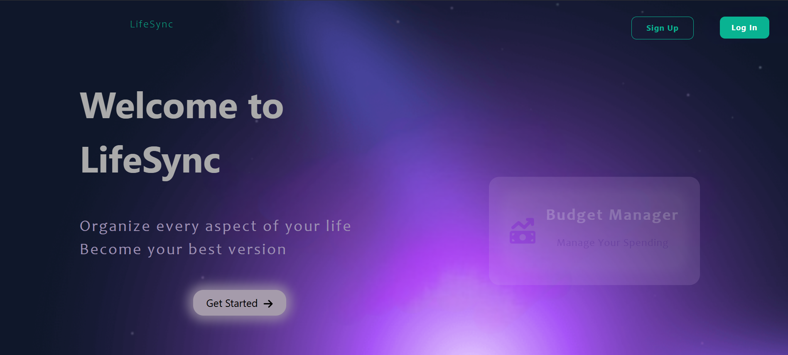

<h1 align="center">📘 Welcome to LifeSync ⭐</h1>



<h2>Tech Stack</h2>


This website uses the MERN framework

##

<ul>
  <li><strong>Frontend:</strong> React</li>
  <li><strong>Backend:</strong> Node.js, Express, MongoDB</li>
  <li><strong>Version Control:</strong> Git and GitHub</li>
  <li><strong>Code Editor and Tools:</strong> VS Code</li>
</ul>

## Overview :rocket:

LifeSync is a full-stack web application designed for life organization through a suite of powerful features.It is currently a non-commercial project, and serves as a learning opportunity to explore and showcase various full-stack development strategies and technologies.

## Features :key:

<ul>
  <li><strong>Task Manager:</strong> personilized to-do lists organized per week days.</li>
  <li><strong>Collaboration Boards:</strong> collaborative tool to share tasks with people.</li>
  <li><strong>Expenses Manager:</strong> budget monitoring tool</li>
  <li><strong>Dashboard:</strong> dynamic dashboard providing relevant statistics</li>
  <li><strong>Role based access:</strong> admin-specific privileges</li>
</ul>

## Running :hammer_and_wrench:

After cloning the project locally, Create a `.env` file in the **backend** folder and add the following variables:

```env
URL=your_mongodb_cluster_url
PORT=your_preferred_port
JWT_SECRET=your_jwt_secret_key
```

Then to start the application:

<ol>
  <li>Navigate to the project root and run <strong>npm start</strong> to launch the React frontend.</li>
  <li>Move into the backend folder and run <strong>npm start</strong> to start the Express server.</li>
  <li>Wait for the backend to establish a connection with the database.</li>
</ol>
